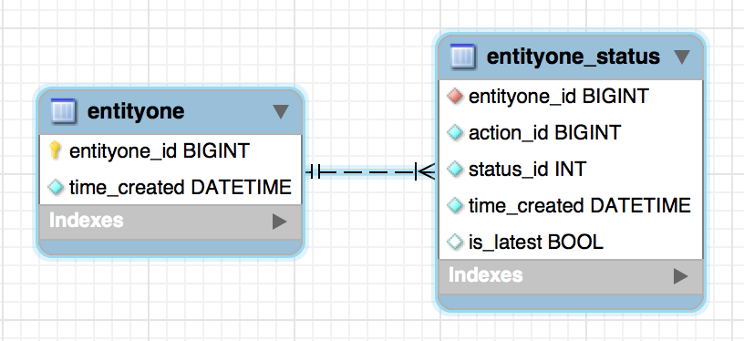

# The db schema




# The results

## SQLite3

```
BenchmarkCreate-8                       	   10000	   7518683 ns/op
BenchmarkUpdateStatus-8                 	   10000	   7913274 ns/op
BenchmarkSelectEntityoneOneByStatus-8   	  500000	    205393 ns/op
BenchmarkSelectEntityoneOneByPK-8       	  500000	    182951 ns/op
PASS
ok  	github.com/vincentserpoul/playwithsql/status/islatest	354.145s
```

## CockroachDB - 1 container

```
BenchmarkCreate-8                       	    5000	  15425321 ns/op
BenchmarkUpdateStatus-8                 	   10000	  11939611 ns/op
BenchmarkSelectEntityoneOneByStatus-8   	     300	 222693116 ns/op
BenchmarkSelectEntityoneOneByPK-8       	       3	28799012640 ns/op
PASS
ok  	github.com/vincentserpoul/playwithsql/status/islatest	469.577s
```

## CockroachDB - 5 containers

```
BenchmarkCreate-8                       	    5000	  21197283 ns/op
BenchmarkUpdateStatus-8                 	    5000	  25218792 ns/op
BenchmarkSelectEntityoneOneByStatus-8   	     500	 224125369 ns/op
BenchmarkSelectEntityoneOneByPK-8       	       2	31793801784 ns/op
PASS
ok  	github.com/vincentserpoul/playwithsql/status/islatest	467.998s
```

## PerconaDB 5.7.15

```
BenchmarkCreate-8                       	   10000	   6687659 ns/op
BenchmarkUpdateStatus-8                 	   20000	   4738893 ns/op
BenchmarkSelectEntityoneOneByStatus-8   	   50000	   1844723 ns/op
BenchmarkSelectEntityoneOneByPK-8       	   50000	   1706539 ns/op
PASS
ok  	github.com/vincentserpoul/playwithsql/status/islatest	422.740s
```

## Postgres 9.6.1

```
BenchmarkCreate-8                       	   20000	   5760065 ns/op
BenchmarkUpdateStatus-8                 	   20000	   4469207 ns/op
BenchmarkSelectEntityoneOneByStatus-8   	   50000	   2108753 ns/op
BenchmarkSelectEntityoneOneByPK-8       	   50000	   1974964 ns/op
PASS
ok  	github.com/vincentserpoul/playwithsql/status/islatest	562.721s
```